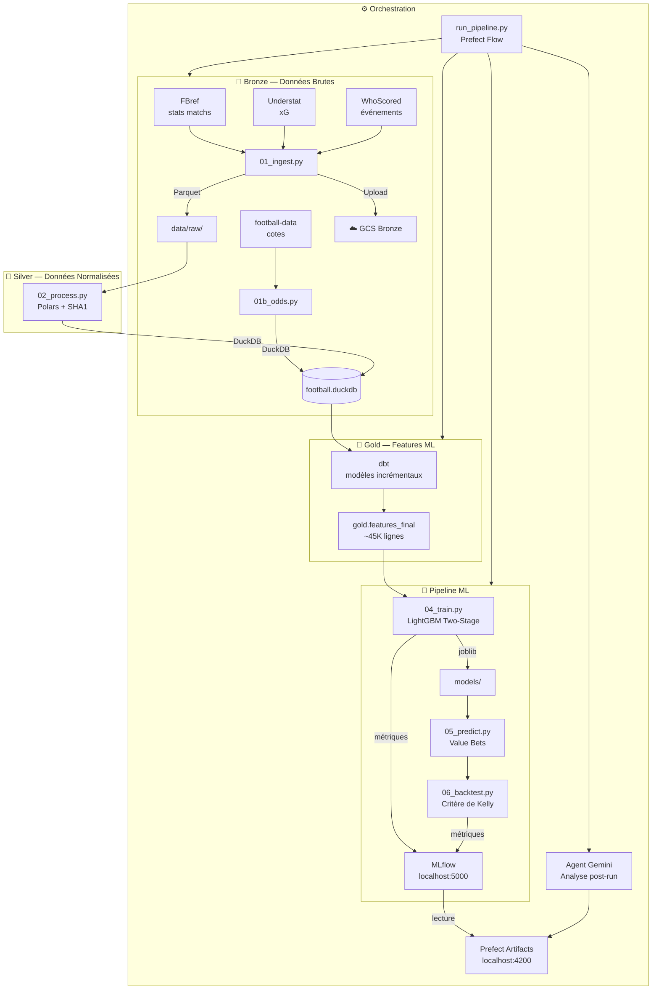

# ⚽ Projet 3-Étoiles — Pipeline de Prédiction de Matchs de Football

[](https://github.com/StephMarcellin/Football_predictor/actions/workflows/dbt-ci.yml)

> Pipeline de données et ML de bout en bout pour la prédiction des résultats de matchs de football (1X2) et la détection de value bets sur les 5 grands championnats européens.


---

## Vue d'ensemble

Projet 3-Étoiles est un pipeline de données et ML de niveau production qui :

1. **Collecte** les données de matchs depuis FBref, Understat et WhoScored
2. **Transforme** les données brutes en features ML via une architecture médaillon Bronze/Silver/Gold (DuckDB + dbt)
3. **Entraîne** un modèle LightGBM à deux étages avec calibration des probabilités
4. **Prédit** les résultats des prochains matchs et détecte les value bets via le critère de Kelly
5. **Backteste** la stratégie de paris et évalue les performances
6. **Orchestre** l'ensemble avec Prefect, trace les expériences avec MLflow, et lance un agent Gemini pour l'analyse post-run

### Interfaces

| Interface | URL | Commande |
|---|---|---|
| Prefect UI (local) | http://localhost:4200 | `make prefect-ui` |
| Prefect Cloud | [Dashboard](https://app.prefect.cloud) | `make pipeline` |
| MLflow UI | http://localhost:5000 | `make mlflow-ui` |

---

## Architecture



---

## Stack Technique

| Couche | Outil | Rôle |
|---|---|---|
| **Stockage** | DuckDB 1.5.1 | Base analytique locale |
| **Traitement** | Polars + pandas | Transformation couche Silver |
| **Feature Engineering** | dbt-duckdb 1.10.1 | Modèles Gold incrémentaux |
| **ML** | LightGBM 4.6 + scikit-learn | Two-stage stacking + calibration |
| **Orchestration** | Prefect 3.6 | Flows, tasks, scheduling, artifacts |
| **Suivi d'expériences** | MLflow 3.10 | Métriques, paramètres, modèles |
| **Agent IA** | Gemini Flash (google-genai) | Analyse ReAct post-pipeline |
| **Conteneurisation** | Docker + docker-compose | Pipeline + Prefect + MLflow |
| **Infrastructure** | Terraform + GCS | Bucket Bronze sur Google Cloud |
| **Logging** | Loguru | Logs centralisés |
| **Validation** | Great Expectations 1.17 | Contrats de données Silver → Gold |
| **Observabilité** | Prefect Cloud | Pipeline observable partout |

---

## Installation

### Prérequis

- Python 3.11+
- Docker Desktop
- `make` (`winget install GnuWin32.Make` sur Windows)
- Compte Google Cloud (pour GCS)

### Installation locale

```bash
# 1. Cloner le repo
git clone https://github.com/StephMarcellin/Projet_3etoiles.git
cd Projet_3etoiles

# 2. Créer et activer l'environnement virtuel
python -m venv .venv
.venv\Scripts\Activate.ps1   # Windows
source .venv/bin/activate     # Linux/Mac

# 3. Installer les dépendances
make install

# 4. Configurer les variables d'environnement
copy .env.example .env
# Remplir .env avec GOOGLE_API_KEY, GCS_BUCKET_NAME, etc.

# 5. Vérifier la configuration
make pipeline-dry
```

---

## Utilisation

### Commandes principales

```bash
make pipeline          # Lancer le pipeline complet (démarre Prefect automatiquement)
make pipeline-dry      # Simuler sans exécuter
make train             # Entraîner le modèle
make predict           # Générer les prédictions
make backtest          # Lancer le backtest (critère de Kelly)
make from-train        # Reprendre depuis l'étape d'entraînement
make agent             # Lancer l'agent Gemini en mode interactif
make list-steps        # Lister toutes les étapes du pipeline
make dbt-docs          # Générer et servir la documentation dbt (lineage)
make help              # Afficher toutes les commandes disponibles
```

### Interfaces locales

| Interface | URL | Commande |
|---|---|---|
| Prefect UI | http://localhost:4200 | `make prefect-ui` |
| MLflow UI | http://localhost:5000 | `make mlflow-ui` |
| dbt Docs | http://localhost:8080 | `make dbt-docs` |

### Avec Docker

```bash
docker-compose up -d prefect mlflow        # Démarrer les serveurs
docker-compose run pipeline make train     # Lancer une étape du pipeline
docker-compose down                         # Arrêter tout
```

---

## Structure du projet

```
Projet_3étoiles/
├── pipelines/              # Scripts du pipeline
│   ├── 01_ingest.py        # Bronze — scraping (FBref, Understat, WhoScored)
│   ├── 01b_odds.py         # Cotes (football-data.co.uk)
│   ├── 02_process.py       # Couche Silver (Polars, normalisation)
│   ├── 04_train.py         # Entraînement LightGBM two-stage
│   ├── 05_predict.py       # Prédictions + value bets
│   ├── 06_backtest.py      # Backtest critère de Kelly
│   ├── run_pipeline.py     # Orchestrateur Prefect
│   ├── agent_gemini.py     # Agent ReAct Gemini
│   └── gcs_utils.py        # Upload Bronze → GCS
├── dbt_project/            # Modèles Gold (features ML)
│   └── models/
│       ├── intermediate/   # Backbone, événements, stats joueurs
│       └── gold/           # features_final (~45K lignes)
├── docs/
│   └── ADR/                # Décisions architecturales documentées (8 ADR)
├── terraform/              # Infrastructure as Code (GCS, compte de service)
├── scripts/                # Scripts utilitaires
├── config/                 # Configuration (config.yaml, credentials)
├── models/                 # Modèles entraînés (.joblib)
├── data/                   # Données Bronze/Silver
├── logs/                   # Logs du pipeline
├── Dockerfile              # Image pipeline
├── Dockerfile.mlflow       # Image MLflow
├── docker-compose.yml      # Orchestration Docker
├── Makefile                # Interface de commandes
└── .env.example            # Template variables d'environnement
```

---

## Architecture Médaillon

Le projet suit une architecture **Bronze / Silver / Gold** :

| Couche | Contenu | Outil |
|---|---|---|
| **Bronze** | Données brutes scrappées, format original | Parquet + GCS |
| **Silver** | Données nettoyées, normalisées, dédupliquées | DuckDB (Polars) |
| **Gold** | Features prêtes pour le ML | DuckDB (dbt) |

---

## Modèle ML

Le modèle utilise une approche **two-stage stacking** :

- **Étage 1** : 3 modèles LightGBM spécialisés (victoire domicile, nul, victoire extérieur)
- **Étage 2** : Meta-modèle LightGBM combinant les prédictions de l'étage 1
- **Calibration** : Régression isotonique pour des probabilités bien calibrées
- **Value bets** : Détection via edge = P(modèle) - P(cotes implicites)
- **Sizing** : Demi-critère de Kelly pour le dimensionnement des mises

---

## Championnats couverts

- 🏴󠁧󠁢󠁥󠁮󠁧󠁿 Premier League + Championship
- 🇫🇷 Ligue 1 + Ligue 2
- 🇩🇪 Bundesliga + 2. Bundesliga
- 🇮🇹 Serie A + Serie B
- 🇪🇸 La Liga + La Liga 2

**Saisons** : 2017-2018 → 2024-2025

---

## Feuille de route

- [ ] Agent d'analyse des features (propositions de nouvelles features)
- [ ] Agent d'analyse du modèle (propositions d'architectures alternatives)
- [ ] Great Expectations — étendre la couverture à la couche Bronze
- [ ] CI/CD via GitHub Actions

---
