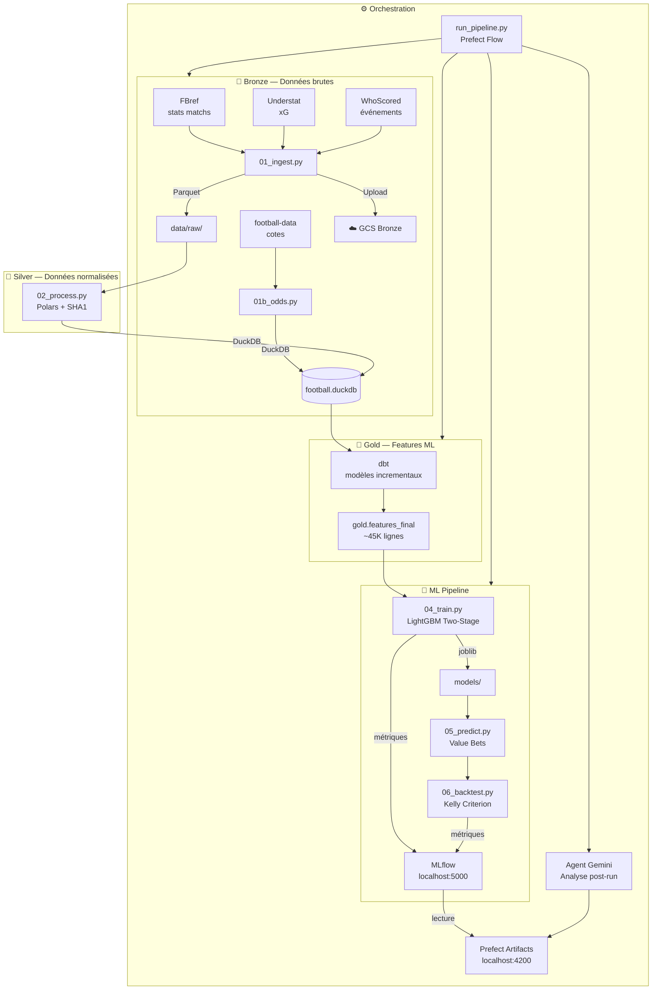

# ⚽ Projet 3-Étoiles — Prédiction de matchs de football

> Pipeline de machine learning end-to-end pour la prédiction de résultats (1N2) et la détection de value bets sur les 5 grands championnats européens.


---

## Vue d'ensemble

Projet 3-Étoiles est un pipeline data/ML complet qui :

1. **Scrape** les données de match depuis FBref, Understat et WhoScored
2. **Transforme** les données brutes en features ML via une architecture Bronze/Silver/Gold (DuckDB + dbt)
3. **Entraîne** un modèle LightGBM two-stage avec calibration de probabilités
4. **Prédit** les résultats des matchs à venir et détecte les value bets via le critère de Kelly
5. **Backteste** la stratégie de paris et analyse les performances
6. **Orchestre** le tout avec Prefect, MLflow pour le tracking, et un agent Gemini pour l'analyse post-run

---

## Architecture



---

## Stack technique

| Couche | Outil | Rôle |
|---|---|---|
| **Stockage** | DuckDB 1.5.1 | Base de données analytique locale |
| **Traitement** | Polars + pandas | Transformation Silver layer |
| **Feature Engineering** | dbt-duckdb 1.10.1 | Modèles Gold incrementaux |
| **ML** | LightGBM 4.6 + scikit-learn | Two-stage stacking + calibration |
| **Orchestration** | Prefect 3.6 | Flow, tasks, scheduling, artifacts |
| **Tracking** | MLflow 3.10 | Métriques, paramètres, modèles |
| **Agent IA** | Gemini Flash (google-genai) | Analyse ReAct post-pipeline |
| **Conteneurisation** | Docker + docker-compose | Pipeline + Prefect + MLflow |
| **Infrastructure** | Terraform + GCS | Bucket Bronze sur Google Cloud |
| **Logs** | Loguru | Logs centralisés |

---

## Installation

### Prérequis

- Python 3.11+
- Docker Desktop
- `make` (`winget install GnuWin32.Make` sur Windows)
- Compte Google Cloud (pour GCS)

### Setup local

```bash
# 1. Cloner le repo
git clone https://github.com/StephMarcellin/Projet_3etoiles.git
cd Projet_3etoiles

# 2. Créer et activer le venv
python -m venv .venv
.venv\Scripts\Activate.ps1   # Windows
source .venv/bin/activate     # Linux/Mac

# 3. Installer les dépendances
make install

# 4. Configurer les variables d'environnement
copy .env.example .env
# Remplir .env avec GOOGLE_API_KEY, GCS_BUCKET_NAME, etc.

# 5. Vérifier la configuration
make pipeline-dry
```

---

## Usage

### Commandes principales

```bash
make pipeline          # Lance le pipeline complet (démarre Prefect automatiquement)
make pipeline-dry      # Simule sans exécuter
make train             # Entraîne le modèle
make predict           # Génère les prédictions
make backtest          # Lance le backtest Kelly
make from-train        # Reprend depuis l'étape train
make agent             # Lance l'agent Gemini en mode interactif
make list-steps        # Liste toutes les étapes
make help              # Affiche toutes les commandes
```

### Interfaces locales

| Interface | URL | Commande |
|---|---|---|
| Prefect UI | http://localhost:4200 | `make prefect-ui` |
| MLflow UI | http://localhost:5000 | `make mlflow-ui` |

### Avec Docker

```bash
docker-compose up -d prefect mlflow        # Démarre les serveurs
docker-compose run pipeline make train     # Lance une étape
docker-compose down                         # Arrête tout
```

---

## Structure du projet

```
Projet_3étoiles/
├── pipelines/              # Scripts du pipeline
│   ├── 01_ingest.py        # Scraping Bronze (FBref, Understat, WhoScored)
│   ├── 01b_odds.py         # Cotes (football-data.co.uk)
│   ├── 02_process.py       # Silver layer (Polars, normalisation)
│   ├── 04_train.py         # Entraînement LightGBM two-stage
│   ├── 05_predict.py       # Prédictions + value bets
│   ├── 06_backtest.py      # Backtest Kelly criterion
│   ├── run_pipeline.py     # Orchestrateur Prefect
│   ├── agent_gemini.py     # Agent ReAct Gemini
│   └── gcs_utils.py        # Upload Bronze → GCS
├── dbt_project/            # Modèles Gold (features ML)
│   └── models/
│       ├── intermediate/   # Backbone, events, player stats
│       └── gold/           # features_final (~45K lignes)
├── terraform/              # Infrastructure as Code (GCS, service account)
├── scripts/                # Scripts utilitaires (wait_for_prefect.ps1)
├── config/                 # Configuration (config.yaml, credentials)
├── models/                 # Modèles entraînés (.joblib)
├── data/                   # Données Bronze/Silver
├── logs/                   # Logs pipeline
├── Dockerfile              # Image pipeline
├── Dockerfile.mlflow       # Image MLflow
├── docker-compose.yml      # Orchestration Docker
├── Makefile                # Interface de commandes
└── .env.example            # Template variables d'environnement
```

---

## Architecture Medallion

Le projet suit une architecture **Bronze / Silver / Gold** :

| Couche | Contenu | Outil |
|---|---|---|
| **Bronze** | Données brutes scrappées, format original | Parquet + GCS |
| **Silver** | Données nettoyées, normalisées, dédupliquées | DuckDB (Polars) |
| **Gold** | Features ML prêtes à l'entraînement | DuckDB (dbt) |

---

## Modèle ML

Le modèle utilise un **two-stage stacking** :

- **Stage 1** : 3 modèles LightGBM spécialisés (Home win, Draw, Away win)
- **Stage 2** : méta-modèle LightGBM qui combine les prédictions du Stage 1
- **Calibration** : isotonic regression pour des probabilités bien calibrées
- **Value bets** : détection par edge = P(modèle) - P(implicite cotes)
- **Sizing** : Half Kelly criterion pour le sizing des mises

---

## Championnats couverts

- 🏴󠁧󠁢󠁥󠁮󠁧󠁿 Premier League + Championship
- 🇫🇷 Ligue 1 + Ligue 2
- 🇩🇪 Bundesliga + 2. Bundesliga
- 🇮🇹 Serie A + Serie B
- 🇪🇸 La Liga + La Liga 2

**Saisons** : 2017-2018 → 2024-2025

---

## Roadmap

- [ ] Agent d'analyse des features (propositions de nouvelles features)
- [ ] Agent d'analyse du modèle (propositions d'architectures alternatives)
- [ ] Great Expectations — data quality checks
- [ ] CI/CD via GitHub Actions
- [ ] Migration MLflow vers backend SQLite
- [ ] Déploiement cloud complet (GCE + Cloud Run)

---

## Licence

MIT