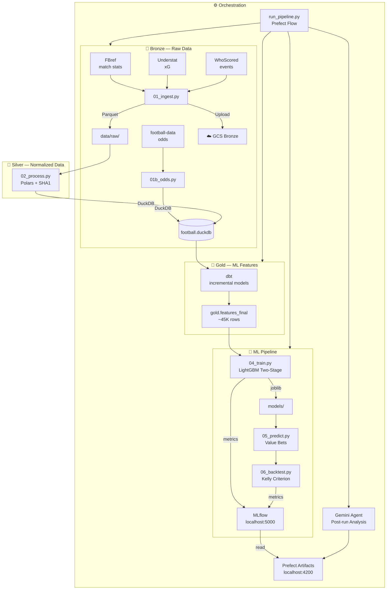

# ⚽ Projet 3-Étoiles — Football Match Prediction Pipeline

> End-to-end machine learning pipeline for football match outcome prediction (1X2) and value bet detection across Europe's top 5 leagues.


---

## Overview

Projet 3-Étoiles is a production-grade data/ML pipeline that:

1. **Scrapes** match data from FBref, Understat and WhoScored
2. **Transforms** raw data into ML features via a Bronze/Silver/Gold medallion architecture (DuckDB + dbt)
3. **Trains** a two-stage LightGBM model with probability calibration
4. **Predicts** upcoming match outcomes and detects value bets using the Kelly criterion
5. **Backtests** the betting strategy and evaluates performance
6. **Orchestrates** everything with Prefect, tracks experiments with MLflow, and runs a Gemini agent for post-run analysis

---

## Architecture



---

## Tech Stack

| Layer | Tool | Role |
|---|---|---|
| **Storage** | DuckDB 1.5.1 | Local analytical database |
| **Processing** | Polars + pandas | Silver layer transformation |
| **Feature Engineering** | dbt-duckdb 1.10.1 | Incremental Gold models |
| **ML** | LightGBM 4.6 + scikit-learn | Two-stage stacking + calibration |
| **Orchestration** | Prefect 3.6 | Flow, tasks, scheduling, artifacts |
| **Experiment Tracking** | MLflow 3.10 | Metrics, parameters, models |
| **AI Agent** | Gemini Flash (google-genai) | ReAct post-pipeline analysis |
| **Containerization** | Docker + docker-compose | Pipeline + Prefect + MLflow |
| **Infrastructure** | Terraform + GCS | Bronze bucket on Google Cloud |
| **Logging** | Loguru | Centralized logging |
| **Validation** | Great Expectations 1.17 | Data contracts Silver → Gold |

---

## Installation

### Prerequisites

- Python 3.11+
- Docker Desktop
- `make` (`winget install GnuWin32.Make` on Windows)
- Google Cloud account (for GCS)

### Local Setup

```bash
# 1. Clone the repo
git clone https://github.com/StephMarcellin/Projet_3etoiles.git
cd Projet_3etoiles

# 2. Create and activate venv
python -m venv .venv
.venv\Scripts\Activate.ps1   # Windows
source .venv/bin/activate     # Linux/Mac

# 3. Install dependencies
make install

# 4. Configure environment variables
copy .env.example .env
# Fill in .env with GOOGLE_API_KEY, GCS_BUCKET_NAME, etc.

# 5. Verify configuration
make pipeline-dry
```

---

## Usage

### Main Commands

```bash
make pipeline          # Run the full pipeline (auto-starts Prefect)
make pipeline-dry      # Simulate without executing
make train             # Train the model
make predict           # Generate predictions
make backtest          # Run Kelly criterion backtest
make from-train        # Resume from train step
make agent             # Launch Gemini agent in interactive mode
make list-steps        # List all pipeline steps
make help              # Show all available commands
```

### Local Interfaces

| Interface | URL | Command |
|---|---|---|
| Prefect UI | http://localhost:4200 | `make prefect-ui` |
| MLflow UI | http://localhost:5000 | `make mlflow-ui` |

### With Docker

```bash
docker-compose up -d prefect mlflow        # Start servers
docker-compose run pipeline make train     # Run a pipeline step
docker-compose down                         # Stop everything
```

---

## Project Structure

```
Projet_3étoiles/
├── pipelines/              # Pipeline scripts
│   ├── 01_ingest.py        # Bronze scraping (FBref, Understat, WhoScored)
│   ├── 01b_odds.py         # Odds (football-data.co.uk)
│   ├── 02_process.py       # Silver layer (Polars, normalization)
│   ├── 04_train.py         # LightGBM two-stage training
│   ├── 05_predict.py       # Predictions + value bets
│   ├── 06_backtest.py      # Kelly criterion backtest
│   ├── run_pipeline.py     # Prefect orchestrator
│   ├── agent_gemini.py     # Gemini ReAct agent
│   └── gcs_utils.py        # Bronze → GCS upload
├── dbt_project/            # Gold models (ML features)
│   └── models/
│       ├── intermediate/   # Backbone, events, player stats
│       └── gold/           # features_final (~45K rows)
├── terraform/              # Infrastructure as Code (GCS, service account)
├── scripts/                # Utility scripts (wait_for_prefect.ps1)
├── config/                 # Configuration (config.yaml, credentials)
├── models/                 # Trained models (.joblib)
├── data/                   # Bronze/Silver data
├── logs/                   # Pipeline logs
├── Dockerfile              # Pipeline image
├── Dockerfile.mlflow       # MLflow image
├── docker-compose.yml      # Docker orchestration
├── Makefile                # Command interface
└── .env.example            # Environment variables template
```

---

## Medallion Architecture

The project follows a **Bronze / Silver / Gold** medallion architecture:

| Layer | Content | Tool |
|---|---|---|
| **Bronze** | Raw scraped data, original format | Parquet + GCS |
| **Silver** | Cleaned, normalized, deduplicated data | DuckDB (Polars) |
| **Gold** | ML-ready features | DuckDB (dbt) |

---

## ML Model

The model uses a **two-stage stacking** approach:

- **Stage 1**: 3 specialized LightGBM models (Home win, Draw, Away win)
- **Stage 2**: Meta LightGBM model combining Stage 1 predictions
- **Calibration**: Isotonic regression for well-calibrated probabilities
- **Value bets**: Detection via edge = P(model) - P(implied odds)
- **Sizing**: Half Kelly criterion for bet sizing

---

## Leagues Covered

- 🏴󠁧󠁢󠁥󠁮󠁧󠁿 Premier League + Championship
- 🇫🇷 Ligue 1 + Ligue 2
- 🇩🇪 Bundesliga + 2. Bundesliga
- 🇮🇹 Serie A + Serie B
- 🇪🇸 La Liga + La Liga 2

**Seasons**: 2017-2018 → 2024-2025

---

## Roadmap

- [ ] Feature analysis agent (new feature proposals)
- [ ] Model analysis agent (alternative architecture proposals)
- [ ] Great Expectations — data quality checks
- [ ] CI/CD via GitHub Actions
- [ ] MLflow migration to SQLite backend
- [ ] Full cloud deployment (GCE + Cloud Run)

---

## License

MIT